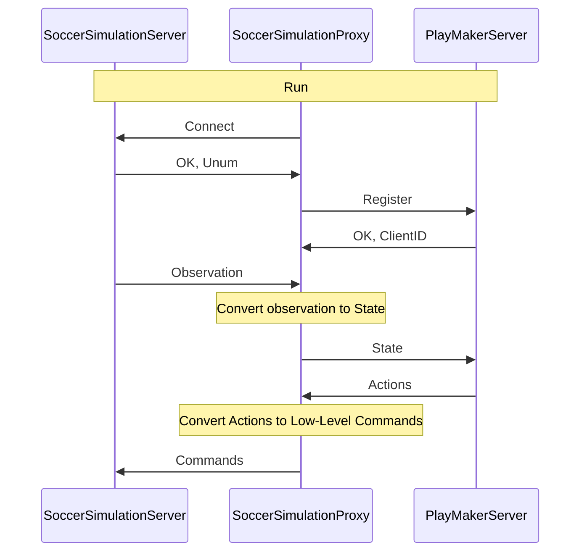

# Sample Python Base Code (gRPC)

[](https://clsframework.github.io/docs/introduction/)
[](https://opensource.org/licenses/MIT)

This repository contains a sample decision-making server for the RoboCup 2D Soccer Simulation, which allows you to create a team by using Python. This server is compatible with the [Cross Language Soccer Framework](https://arxiv.org/pdf/2406.05621). This server is written in Python and uses gRPC to communicate with the [proxy](https://github.com/CLSFramework/soccer-simulation-proxy).

The Soccer Simulation Server sends the observations to the proxy, which processes the data, create state message and sends it to the decision-making server. The decision-making server then sends the actions to the proxy, and then the proxy convert actions to the server commands and sends them to the server.

For more information, please refer to the [documentation](https://clsframework.github.io/).

You can find more information about the services and messages in the [IDL section](../../3-idl/protobuf.md).

## Quick start

### Preparation

Install the pre-requisites using the command below:

``` Bash
sudo apt-get install fuse #Used to run AppImages
```

Clone this repository & install the required python libraries (such as gRPC). Don't forget to activate your virtual environment!

``` Bash
git clone https://github.com/CLSFramework/sample-playmaker-server-python-grpc.git
cd sample-playmaker-server-python-grpc
# Activate venv/anaconda before this step!
pip install -r requirements.txt

./generate.sh # Generate the gRPC files
```

To download RoboCup Soccer 2D Server using the commands below:

``` Bash
pushd scripts
sh download-rcssserver.sh # Download the soccer simulation server
popd
```

Next, download the soccer proxy, which uses C++ to read and pre-processes state data and passes them to the Python server (this project) for decision-making.

``` Bash
pushd scripts
sh download-proxy.sh #install C++ proxy
popd
```

Finally, to watch the game, download the monitor from [the original repository](https://github.com/rcsoccersim/rcssmonitor/releases) in order to view the games.

### Running a game

This section assumes you have installed the server & proxy using the scripts (as mentioned above)
We must first run a RoboCup Server, in order to host the game:

``` Bash
cd scripts/rcssserver
./rcssserver
```

Then we must run the proxy & the decisionmaking server:

``` Bash
./start-team.sh
```

### Options

- `-t team_name`: Specify the team name.
- `--rpc-port PORT`: Specify the RPC port (default: 50051).
- `-d`: Enable debug mode.


Launch the opponent team, start the monitor app image. press <kbd>Ctrl</kbd> + <kbd>C</kbd> to connect to the server, and <kbd>Ctrl</kbd> + <kbd>K</kbd> for kick-off!

### Tutorial Video (English)

[](https://www.youtube.com/watch?v=hH-5rkhiQHg)

### Tutorial Video (Persian)

[](https://www.youtube.com/watch?v=97YDEumcVWU&t=0s)

## How to change the code

The `server.py` file contains the logic in 3 main functions:
`GetPlayerActions` receives a game state, and returns a list of actions for a player for for that cycle.
The actions we can output are equivalent to the Helios Base (Proxy), which are abstracted into multiple levels.
You can use actions such as `DoDash`, `DoTurn`, `DoKick` which directly apply force, or use actions such as `GoToPoint`, `SmartKick`, `Shoot` or [more](https://clsframework.github.io/docs/idl/).

Similarly, you can change `GetCoachActions` which is responsible for coach communication & substitutions.

You can also use `GetTrainerActions` to move the players & the ball to make repeatable scenarios (when the server is in trainer mode).

## Why & How it works

Originally the RoboCup 2D Soccer Simulation teams used C++, as the main code base (Agent2D aka Helios Base) was written in this language due to its performance.
Due to the popularity of python in Machine Learning & AI spaces we decided to create a python platform which would be equivalent to Agent 2D.
However, using python alone was too slow as preprocessing sensor information & tasks such as localization took too long.

For this reason we have split up the code into two segments:
The data processing section in proxy, which creates a World Model (state), and passes it to python for planning to occur. This repository uses gRPC to pass along the World Model, but there is a sister-repo which is compatible with thrift.




As seen in the figure, the proxy handles connecting to the server, receiving sensor information and creating a world-model, and finds the action to take via a remote procedure call to a decision-making server, which is this repository.

## Configuration

### RoboCup Server configuration

You can change the configuration of the RoboCup server and change parameters such as players' stamina, game length, field length, etc. by modifying `~/.rcssserver/server.conf`. Refer to the server's documents and repo for a more detailed guide.

### Modifying Proxy & Running proxy and server seperately

If you want to modify the algorithms of the base (such as ball interception, shooting, localization, etc.) you must modify the code of the [proxy repo](https://github.com/CLSFramework/soccer-simulation-proxy). After re-building from source, you can run the proxy by using `./start.sh --rpc-type grpc` in the bin folder of the proxy, and run the gRPC server with `python3 server.py` in this repo's directory. It is highly recommended to launch the python server before the proxy.

You can modify the rpc port by adding the argument `--rpc-port [VALUE]`, where the default is 50051.

## Citation

- [Cross Language Soccer Framework](https://arxiv.org/pdf/2406.05621)
- Zare, N., Sayareh, A., Sadraii, A., Firouzkouhi, A. and Soares, A., 2024. Cross Language Soccer Framework: An Open Source Framework for the RoboCup 2D Soccer Simulation. arXiv preprint arXiv:2406.05621.
